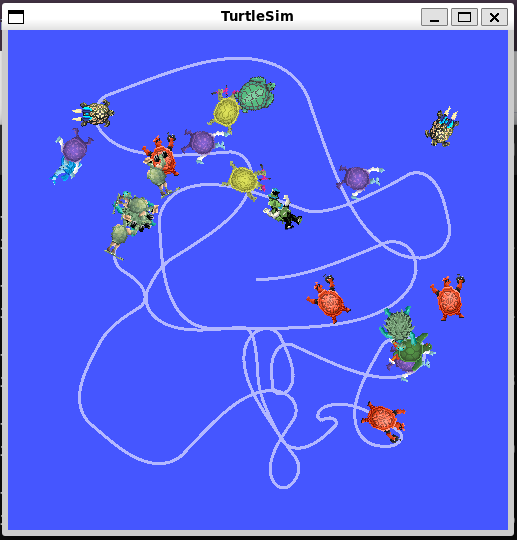

# ROS2 Turtle Simulation Project

A ROS 2 catch-the-turtle game: a spawner node continuously spawns turtles at random positions in turtlesim, and a controller node drives the main turtle toward the closest one, catching (killing) it on contact and repeating.

## Run Command
- colcon build
- source install/setup.bash
- ros2 launch my_bringup turtlesim_catch_them_all.launch.xml
